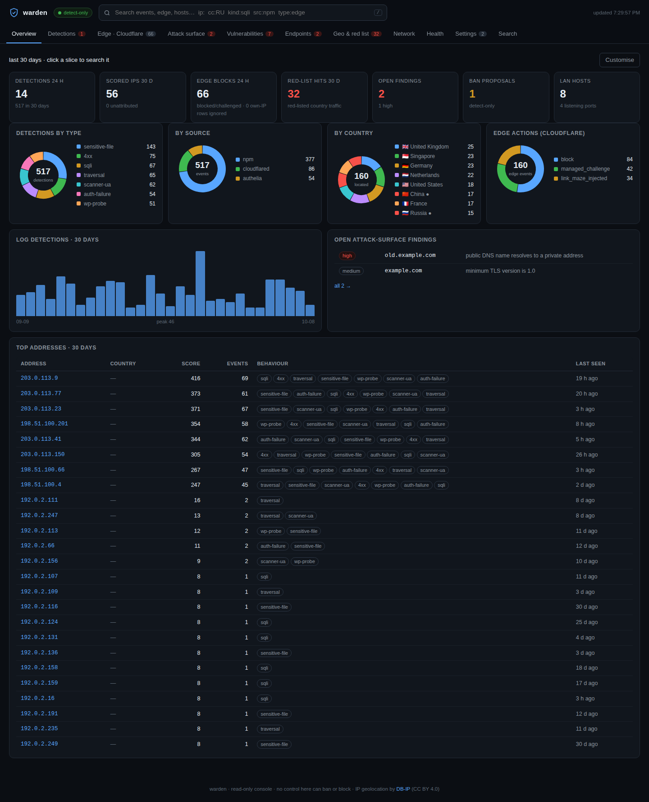
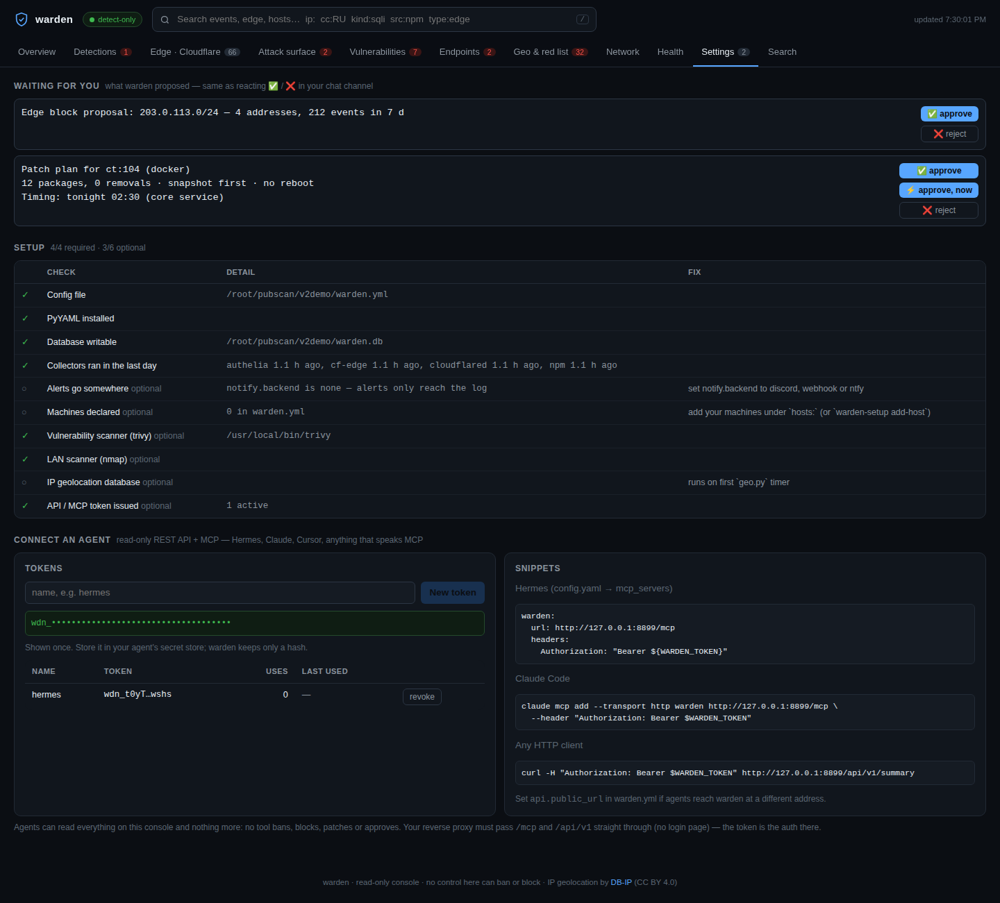
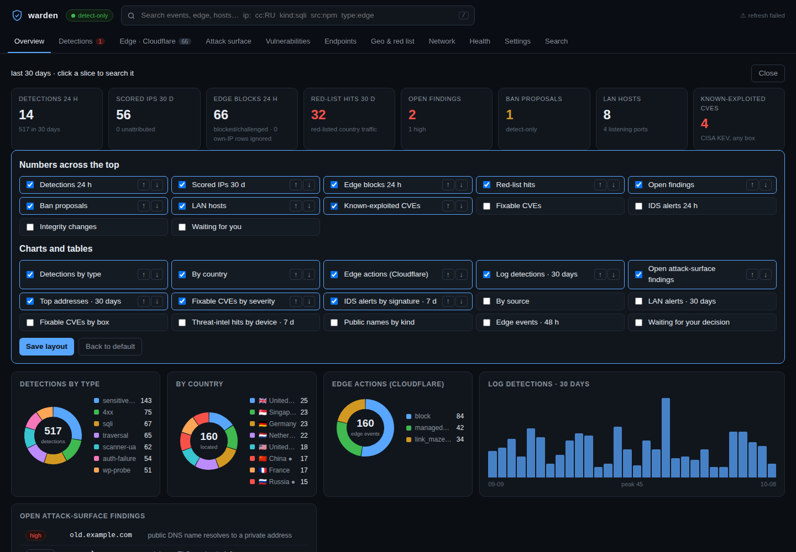
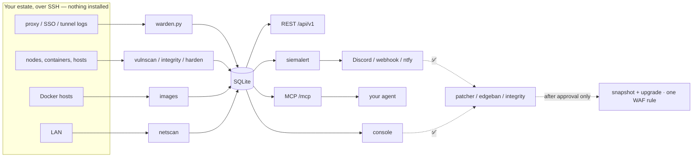

<h1> warden</h1>

A lightweight, self-hosted security console for a homelab or small estate. warden reads the logs your WAF can't see, sweeps your LAN, scans your machines and containers for vulnerabilities, watches files for drift, and lets your AI agent ask it questions over MCP. Detect-only by default: anything that changes something waits for your approval.



*The Overview on demo data (`tools/demo.py`: documentation addresses only). Every chart and number on it can be swapped. See [Make the home page yours](#make-the-home-page-yours).*

   

## Contents

- [What's new in v2](#whats-new-in-v2)
- [What it does](#what-it-does)
- [How it compares](#how-it-compares)
- [Minimum spec](#minimum-spec)
- [Quick start](#quick-start)
- [Connect your agent (MCP and REST)](#connect-your-agent-mcp-and-rest)
- [Make the home page yours](#make-the-home-page-yours)
- [Approvals](#approvals)
- [Configuration](#configuration)
- [How it works](#how-it-works)
- [Security model](#security-model)
- [Status, limits and real results](#status-limits-and-real-results)
- [Roadmap](#roadmap)
- [Support and licence](#support-and-licence)

## What's new in v2

- **Its own sign-in.** Users with viewer, approver and admin roles, optional 2FA from any authenticator app, lockout after repeated failures, and a sign-in log. No web sign-up: the first admin is made on the command line. Prefer your SSO? `ui.auth: proxy` keeps it.
- **Runs on your estate, not the author's.** Machines, log sources, alerts and secrets are all in `warden.yml`. `warden-setup init` writes it for you.
- **An MCP connector and a REST API**, both read-only and token-protected, so Hermes, Claude, Cursor or a script can ask "what's attacking me?" and get real data back.
- **A home page you can arrange**: pick which numbers, pies, timelines and tables appear, and in what order.
- **Approvals without chat**: Discord reactions still work, and now the dashboard's Settings tab can approve or reject too, so a webhook or ntfy setup gets the full feature set.
- **Eleven more modules**: vulnerability scanning, patch proposals, file integrity, hardening audits, network IDS, router threat-intel, Cloudflare edge blocklist and more (listed below).
- **A setup check that asks the running system.** A key that stopped working shows as missing, not ticked.

## What it does

| Area | Module | What you get |
|---|---|---|
| Log detection | `warden.py` | Scores reverse-proxy, SSO and tunnel logs (path traversal, `.env`/`.git` probes, SQLi, scanner agents, auth failures). Proposes per-IP and /24 bans. Never bans you, private ranges or Cloudflare. |
| LAN | `netscan.py` | ARP discovery every 15 min, daily port sweep, new-device, IP-conflict and new-port alerts, with a learning window so sleeping bulbs don't page you. |
| Vulnerabilities | `vulnscan.py`, `images.py` | Agentless: copies only the package database off each box and matches it against [OSV.dev](https://osv.dev) (fed directly by Debian, Ubuntu, Alpine, GitHub, PyPA and the Go team), plus Alpine's own secdb; reads OS, Python, npm, Go and Rust packages inside the images of running containers; ranks CISA known-exploited > likely to be exploited (FIRST EPSS ≥ 10% with a fix) > critical with a fix > the rest. Optional `vulnbrief.py` turns the ranking into a short AI-written "fix first" list, using any OpenAI-compatible endpoint; it only sees the scan's facts, and a briefing that names any CVE, box, image, package or number not in them is withheld. Checks NAS firmware against the vendor's latest release. |
| Patching | `patcher.py` | Turns a request into a plan (packages, removals, snapshot, reboot) and waits for your ✅. Snapshots containers first. Holds core services for the night window. Never auto-reboots a hypervisor. |
| Endpoint drift | `integrity.py`, `harden.py` | Agentless file and config baselines with ✅-to-accept; weekly Lynis hardening score per box (run from a temp dir, nothing left installed). |
| Network IDS | `netids.py`, `netintel.py` | Pulls Suricata alerts; checks router DNS and connection logs against threat feeds. Both optional. |
| Edge | `intel.py`, `edgeban.py`, `cfsec.py`, `edge-sentry/` | Cloudflare edge events, an attack-surface snapshot (public names, WAF rules, zone settings, SSO coverage), a proposed edge blocklist, a zone audit, and a report-only Worker. All optional. |
| Alerts | `siemalert.py`, `wlib/notify.py` | New findings to Discord, a webhook or ntfy, with self-report suppression. |
| Console | `warden-ui.py`, `wlib/auth.py` | Thirteen tabs, sign-in with roles and 2FA, unified search (`ip:` `cc:` `kind:` `type:`), per-collector health, a customisable home page, settings and approvals. |
| Agents | `wlib/mcp.py`, `/api/v1` | Thirteen read-only MCP tools and the same views over REST. |

Every optional feature switches itself off when it isn't configured. A box with no Cloudflare zone never runs the Cloudflare jobs.

## How it compares

Every piece of warden exists somewhere else, often done better. What warden adds is the combination: no agents on your machines, one small box (1 vCPU, 512 MB), Cloudflare edge bans worked out from the logs you already have, and nothing banned or patched until a person says yes. It's meant to sit next to these tools, not replace them.

| Tool | What it does well | How warden differs | Licence |
|---|---|---|---|
| [Wazuh](https://github.com/wazuh/wazuh) | Full SIEM/XDR: vulnerability detection, file integrity, config checks, active response | Wazuh puts an agent on every host, and its all-in-one install asks for [4 vCPU and 8 GB](https://documentation.wazuh.com/current/quickstart.html). warden is agentless and much smaller, and does much less. | GPL-2.0 |
| [CrowdSec](https://github.com/crowdsecurity/crowdsec) | Log parsing, community blocklists, bouncers that block automatically | CrowdSec's bouncers act on their own. warden asks first, and was built for a Cloudflare tunnel, where a local firewall ban never matches the attacker's packets. warden runs happily alongside it. | MIT |
| [PatchMon](https://github.com/PatchMon/PatchMon) | Patch management with approvals and Proxmox LXC auto-enrolment | PatchMon needs an agent per host plus Postgres and Redis. warden patches over SSH and also does detection, IDS and edge bans. | AGPL-3.0 |
| [Vuls](https://github.com/future-architect/vuls) | Agentless vulnerability scanning over SSH | Vuls is a scanner. warden does the same job against OSV.dev with no scanner binary, and adds patch plans, detection and approvals around it. | GPL-3.0 |
| [Security Onion](https://github.com/Security-Onion-Solutions/securityonion) | Network security monitoring, Suricata, hunting | Security Onion is a full platform with [much bigger hardware needs](https://docs.securityonion.net/en/2.4/hardware.html). warden just reads alerts from a Suricata you already run. | Elastic License 2.0 |
| [BunkerWeb](https://github.com/bunkerity/bunkerweb) | A reverse proxy + WAF with bad-IP blocklists | BunkerWeb *is* your proxy. warden reads the logs of the proxy you already have. | AGPL-3.0 |
| [Fail2ban](https://github.com/fail2ban/fail2ban) | Bans from log patterns | Single-purpose, bans automatically, and behind a tunnel its firewall bans hit the tunnel, not the attacker. | GPL-2.0 |

Vulnerability data comes from [OSV.dev](https://osv.dev); host hardening and network IDS are done by [Lynis](https://cisofy.com/lynis/) and [Suricata](https://suricata.io/); warden joins their results up. Compared from each project's own docs in October 2026. If something here is out of date or unfair, open an issue and I'll fix it.

## Minimum spec

Measured on the author's running install (Ubuntu 24.04, Python 3.12, an LXC container watching two Proxmox nodes, a NAS, ~50 LAN devices and 15 containers), October 2026:

| Recommended | Core (detection, LAN, console, API, MCP) | Plus vulnerability scanning |
|---|---|---|
| CPU | 1 vCPU | 1–2 vCPU |
| RAM | 512 MB | 1.5 GB |
| Disk | 300 MB | 2.5 GB |
| Measured | console 29 MB resident (70 MB peak); warden + its data 122 MB | trivy server 89 MB resident, its database cache 1.4 GB, binary 161 MB; the daily scan used 24 CPU-seconds (its memory peak was not measured, hence the headroom) |

- **OS:** Linux with systemd and Python 3. Tested on Ubuntu 24.04 (Python 3.12) and Debian 13 (Python 3.13), x86_64. Other distros and arm64 should work but are untested.
- **Packages:** `python3-yaml`, `python3-requests`; `nmap` for LAN discovery. Vulnerability scanning needs no extra software: outbound HTTPS to api.osv.dev and secdb.alpinelinux.org, and `python3` on docker hosts (for the image collector, fed over SSH; nothing is installed).
- **Access:** SSH keys to the machines you want scanned. Nothing is installed on them.
- **Why not trivy:** warden used trivy until 2026-10-10. Its 0.69.4 release and 0.69.5/0.69.6 images were malicious (CVE-2026-33634), and it needed a 161 MB binary, a 1.4 GB database and a server. OSV.dev gives the same advisories with nothing to download or keep patched.

## Quick start

```sh
git clone https://github.com/casareanderson/warden.git /opt/warden
cd /opt/warden
sudo apt install python3-yaml python3-requests nmap
./warden-setup init                 # estate, alerts, machines, Cloudflare → warden.yml
./warden-setup check --hosts        # asks the running system what works
sudo ./warden-setup units --install # writes + enables only the timers for features you use
```

Then make yourself an admin and open the console:

```sh
./warden-setup user add YOUR-NAME --role admin   # prints a one-time password; you pick your own at first sign-in
```

The console binds to `127.0.0.1:8792`; put HTTPS (a reverse proxy) in front of it. It has its own sign-in page with roles and optional 2FA. If your proxy already signs people in (Authelia, Authentik, oauth2-proxy), set `ui.auth: proxy` instead.

Want to look before you wire anything up?

```sh
WARDEN_DATA=/tmp/warden-demo python3 tools/demo.py
WARDEN_DATA=/tmp/warden-demo ./warden-setup user add demo --role admin
WARDEN_DATA=/tmp/warden-demo python3 warden-ui.py   # http://127.0.0.1:8792, sign in as demo
```

## Connect your agent (MCP and REST)



1. Mint a token: **Settings → Connect an agent → New token**, or `./warden-setup token hermes`. It's shown once; warden stores only its hash.
2. Point your agent at `/mcp`:

```yaml
# Hermes: ~/.hermes/config.yaml → mcp_servers
warden:
  url: https://warden.example.com/mcp
  headers:
    Authorization: "Bearer ${WARDEN_TOKEN}"
```

```sh
# Claude Code
claude mcp add --transport http warden https://warden.example.com/mcp --header "Authorization: Bearer $WARDEN_TOKEN"
# anything else
curl -H "Authorization: Bearer $WARDEN_TOKEN" https://warden.example.com/api/v1/summary
```

**Tools:** `warden_summary` (start here), `warden_detections`, `warden_top_ips`, `warden_lookup_ip`, `warden_search`, `warden_bans`, `warden_vulnerabilities`, `warden_attack_surface`, `warden_network`, `warden_ids`, `warden_integrity`, `warden_health`. The REST views mirror them at `/api/v1/<view>`; `/api/v1/openapi.json` describes them.

**Read-only, enforced by a test.** No tool can ban, block, patch or approve. A model that can reach your firewall through a chat window is a different risk class; it can tell you what to do, and you decide.

If your reverse proxy has a login page, let `/mcp` and `/api/v1` straight through. An MCP client has no browser and can't follow a login redirect; the bearer token is the auth on those two paths.

## Make the home page yours



Press **Customise** on the Overview. Tick the numbers and charts you want, use ↑ ↓ to order them, and **Save layout**. Fifteen charts and tables and twelve headline numbers are available, including fixable CVEs, known-exploited CVEs, IDS alerts, threat-intel hits, integrity changes and decisions waiting for you. The layout is stored in warden's database, so it survives upgrades, and **Back to default** undoes it. It works on a phone too (no sideways scrolling at 390 px).

## Approvals

warden proposes; you decide. Patch plans, edge-block proposals and integrity changes each arrive as a message with ✅ / ❌ (and ⚡ "do it now" for patches).

- **Discord:** react on the message. Only `notify.owner_id`'s reactions count.
- **Anything else (webhook, ntfy, none):** **Settings → Waiting for you** has the same buttons. A dashboard decision counts as the owner's and the first decision wins.

Unanswered proposals expire and nothing changes.

## Configuration

`warden-setup init` writes `warden.yml`; [warden.yml.example](warden.yml.example) documents every key. The sections:

| Section | What it's for |
|---|---|
| `enforce`, `ban_threshold`, `allow`, … | Detection thresholds and your own IPs (never banned). |
| `estate` | Name, public domain, LAN ranges, timezone, the box warden runs on. |
| `sources` | Where the logs are: `ssh: user@host` (or `local`) and an optional `container`. |
| `hosts`, `roles`, `core` | Machines to scan and patch: `proxmox`, `docker`, `linux` or `local`. Proxmox nodes report their running containers on every run. |
| `notify` | `discord`, `webhook`, `ntfy` or `none`. |
| `secrets` | Names only. Values come from the environment, `data/secrets.env` (mode 600, `warden-setup secret NAME`), Infisical or a command. |
| `cloudflare`, `ids`, `router` | Optional integrations. |
| `ui`, `api`, `dashboard` | Console bind address and auth, the public URL agents use, and the default home layout. |

## How it works



Everything shares one SQLite file. Collectors run on systemd timers; the console, API and MCP read that file and nothing else. Three lessons built into the detector:

1. **An event's time is the time in the log line.** The first run ingests weeks of backlog; stamped "now", old history would fall inside the ban window.
2. **A fixed `--since 10m` under a 5-minute timer double-counts.** Collectors keep real watermarks plus a content hash against restarts and rotation.
3. **A per-IP threshold misses subnet spread.** The /24 roll-up catches seven addresses each just under the line.

```
warden/
├── warden.py            log collectors, scoring, ban proposals
├── warden-ui.py/.html   console + REST API + MCP
├── warden-setup         init, check, add-host, tokens, connect, units
├── wlib/                config, secrets, notify/approvals, hosts, views, mcp, tokens, setup, units
├── netscan.py  vulnscan.py  images.py  patcher.py  integrity.py  harden.py
├── intel.py  edgeban.py  cfsec.py  netids.py  netintel.py  siemalert.py  geo.py  warden-facts.py
├── edge-sentry/         report-only Cloudflare Worker (+ 11 offline tests)
├── tools/demo.py        demo data for screenshots and try-outs
├── tests/               36 tests: API, MCP traps, read-only guard, hosts, patch timing, intel
└── KNOWN-ISSUES.md      read before enforce: true
```

## Security model

- **The console has its own sign-in** (`ui.auth: local`): scrypt-hashed passwords, session cookies stored only as hashes (HttpOnly, SameSite=Strict, Secure behind HTTPS), idle and absolute timeouts, lockout after 5 misses plus a per-address limit, one error message whether the name or the password was wrong, optional TOTP 2FA, and roles checked on the server for every change. There is no web sign-up. Disabling or demoting someone ends their sessions immediately.
- **Detect-only by default.** `enforce: false` records what warden would ban and changes nothing.
- **Nothing acts without you.** Patching, edge blocks and baseline changes each need an explicit ✅, expire if ignored, and are logged with who decided.
- **Agents read; people decide.** MCP and REST are read-only, and a test fails if any tool name contains a write verb.
- **Tokens are hashed at rest** (`wdn_` + 32 random bytes, SHA-256 stored), counted on every use, revocable at once.
- **Browser writes are same-origin only** and need an `X-Warden` header, so a link on another site can't fire them. The console's systemd unit may write only the data directory.
- **Secrets are names in config, never values.** Values live in the environment, a mode-600 file, or your secret manager.
- **Agentless.** Scans copy package metadata off a box; Lynis runs from a temp directory and is removed.

## Status, limits and real results

Status: v2.0, running in detect-only mode on the author's estate since September 2026. It's a second opinion, not a replacement for CrowdSec or a WAF: it reads what they miss.

Measured on that estate:

- **The loudest signal was the owner.** In one week, 27 of 29 application-layer events came from the estate's own WAN address: a phone photo app requesting thumbnails for deleted assets.
- **ARP sees only what is awake.** Two sweeps twelve minutes apart found 48 then 46 devices; six "new" ones were bulbs and a TV that had been asleep. That's why `learn_hours` exists.
- **Percent-encoding defeats a naive WAF rule.** `union select` never matches `union%20select`. Both the Worker and the proposed rule now decode first.
- **Raw CVE counts are mostly noise.** One container had 4,592 findings and 0 with a fix available, which is why the console leads with fixable and known-exploited.

Known limits (full list in [KNOWN-ISSUES.md](KNOWN-ISSUES.md)): the legacy Cloudflare IP Access Rules enforcement path is less proven than detection, and bans don't expire there; a broken SSH connection looks like a quiet log (watch Health); log formats assume NGINX/NPMplus, Authelia and cloudflared.

## Roadmap

- **Cloud connectors:** read-only posture checks for your own cloud accounts.
- **An evolve agent:** watches security advisories and tool trends, and proposes improvements to warden's own rules with the same ✅ / ❌ flow.
- More log formats (Caddy, Traefik, Authentik).

## Support and licence

If warden is useful to you, [buy me a coffee](https://buymeacoffee.com/iamc_tech). More field notes at [dev.to/iam-tech](https://dev.to/iam-tech).

Copyright (c) 2026 Christian Asare-Anderson. Licensed under the GNU Affero General Public License v3.0, see [LICENSE](LICENSE). If you run a modified warden as a network service, the AGPL requires you to offer your users the modified source. For a commercial licence without those terms, open an issue.

Versions up to and including commit `48f2ba1` (2026-10-08) were released under MIT and remain available under MIT; everything after is AGPL-3.0 only. IP geolocation by [DB-IP](https://db-ip.com) (CC BY 4.0). `netscan.py` calls [nmap](https://nmap.org) under its own licence. Vulnerability data: [OSV.dev](https://osv.dev) (CC-BY 4.0 and per-source licences) and Alpine secdb. Cloudflare IP ranges are Cloudflare's published list.
