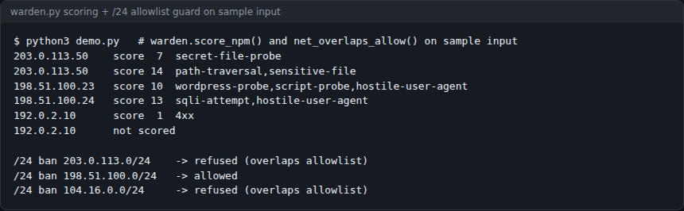
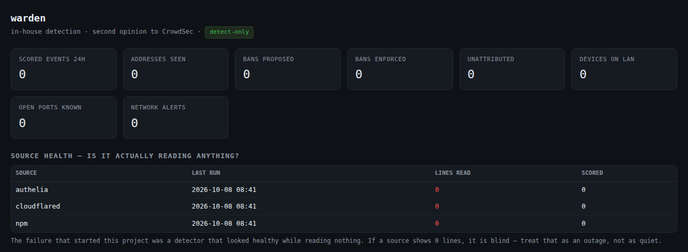
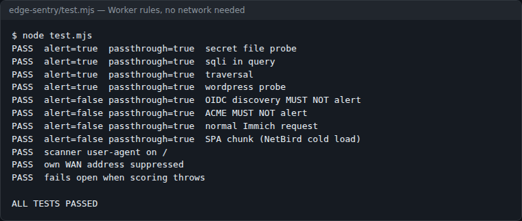
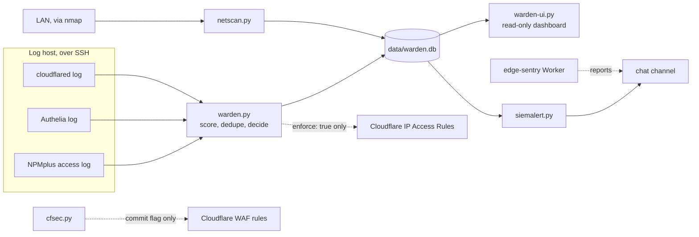

# warden

A dependency-free intrusion detector for a homelab behind a Cloudflare tunnel: it reads the logs your WAF can't see, scores hostile behaviour, and proposes bans at the Cloudflare edge. Detect-only by default.



*The real scorer (`score_npm()`) and range guard (`net_overlaps_allow()`) run against sample lines using documentation addresses. `203.0.113.7` is in the allowlist, so its whole /24 is refused.*

  

## Contents

- [The idea](#the-idea)
- [What it does](#what-it-does)
- [Screenshots](#screenshots)
- [Quick start](#quick-start)
- [Usage](#usage)
- [Configuration](#configuration)
- [How it works](#how-it-works)
- [Status, limits and real results](#status-limits-and-real-results)
- [Licence and credits](#licence-and-credits)

## The idea

If your services sit behind a Cloudflare tunnel, a local `iptables` ban does nothing. At layer 3 every packet comes from Cloudflare's edge. The attacker's real IP exists only in the HTTP layer (`CF-Connecting-IP`). So:

- a local ban keyed on the attacker never matches a packet, and
- banning what does arrive at layer 3 bans Cloudflare and takes your whole estate offline.

warden reads the real IP out of the access logs and enforces with Cloudflare IP Access Rules, before traffic enters the tunnel. There is no `iptables` or `nftables` code in it.

## What it does

- **Tails three log sources** every run: an nginx/NPMplus access log, an Authelia auth log, and the `cloudflared` tunnel log (the only place direct-to-origin hostnames show up).
- **Scores requests** against a small rule set: path traversal, `/etc/passwd`, `.env`/`.git`/`.aws` probes, SQL injection, scanner user agents, WordPress and phpMyAdmin sweeps, and one point for bare 4xx noise.
- **Proposes a ban** when one IP crosses a score threshold inside a time window, and rolls activity up to a /24 to catch an attacker spread thin across a subnet.
- **Refuses to ban yourself**: private ranges, Cloudflare's published ranges and your allowlist can never be banned, and a /24 that merely contains an allowed address is refused too.
- **Serves a read-only dashboard** with per-source health, so a blind collector shows up as "0 lines read" rather than as a quiet day. There is no ban button.
- **Ships four companion pieces** sharing one SQLite store: LAN discovery (`netscan.py`), chat alerts (`siemalert.py`), a Cloudflare zone audit (`cfsec.py`) and an edge Worker (`edge-sentry/`).

## Screenshots



*`warden-ui.py` after one sweep from a fresh clone with no log host set. Every source reads 0 lines and is shown in red: the dashboard tells you the collectors are blind rather than reporting a quiet day.*



*`node edge-sentry/test.mjs`: the Worker's rules exercised with a stubbed `fetch`, no network needed. ACME and OIDC discovery paths must not alert, your own address is suppressed, and the Worker fails open if scoring throws.*

## Quick start

You need Python 3 and SSH access to the host where your log containers run. Nothing to `pip install`.

```sh
git clone https://github.com/casareanderson/warden.git
cd warden
cp warden.yml.example warden.yml       # put YOUR public IPs under allow:
python3 warden.py
```

Success with no log host configured looks like this, and creates `data/warden.db`:

```
warden: 0 scored events, 0 ban(s) proposed (detect-only)
```

Point it at your logs and look at the dashboard:

```sh
export WARDEN_LOG_HOST=user@loghost    # SSH target holding the log containers
python3 warden.py                      # one sweep; run it from a 5-minute timer
python3 warden-ui.py                   # read-only dashboard on 127.0.0.1:8792
```

The collectors run `docker exec` against containers named `npmplus`, `crowdsec` and `cloudflared` on that host. If your logs live elsewhere, change `collect_npm()`, `collect_authelia()` and `collect_cloudflared()` in `warden.py` (about ten lines each).

## Usage

**Log-side detection.** Run `python3 warden.py` on a timer. It prints how many events it scored and how many bans it proposed. Proposals land in the `bans` table and on the dashboard with state `proposed`.

**LAN discovery.** Needs `nmap` and a network interface on every network you list.

```sh
cp netscan.yml.example netscan.yml     # your networks, your critical hosts
python3 netscan.py --no-ports          # ARP discovery only; every 15 minutes
python3 netscan.py                     # discovery plus TCP port sweep; daily
```

The first sweep becomes the baseline and raises no new-device alerts.

**Cloudflare audit and WAF rules.** Needs a token with Zone:Read, Zone Settings:Read and Zone WAF:Read (Zone WAF:Edit to apply).

```sh
export CF_API_TOKEN=...  CF_ZONE_ID=...
python3 cfsec.py                       # audit, read-only
python3 cfsec.py --apply-waf           # show the proposed WAF rules (dry run)
python3 cfsec.py --apply-waf --commit  # create them
```

**Alerts.** `python3 siemalert.py --dry-run` prints the message it would send for new netscan, warden and CrowdSec findings. Sending uses this estate's `notify.send_discord` helper, so wire your own sender in before running it without `--dry-run`.

**Edge Worker tests.** `cd edge-sentry && node test.mjs` runs the 11 tests shown above. Deployment steps are in [edge-sentry/DEPLOY.md](edge-sentry/DEPLOY.md).

## Configuration

`warden.yml` (a small YAML subset parsed without PyYAML). Defaults are the values used when the key is missing.

| Key | Default | What it does |
|---|---|---|
| `enforce` | `false` | `false` records proposed bans only. `true` posts them to Cloudflare IP Access Rules. Read [KNOWN-ISSUES.md](KNOWN-ISSUES.md) first. |
| `ban_threshold` | `12` | Per-IP score total inside the window needed to propose a ban. |
| `window_minutes` | `60` | Scoring window. |
| `max_bans_per_run` | `3` | Cap on proposals per sweep. |
| `subnet_threshold` | `20` | /24 score total needed for a range proposal. |
| `subnet_min_ips` | `3` | Distinct addresses needed in the /24 as well. |
| `ban_hours` | `24` | Written as the ban's expiry. Nothing removes the rule yet; see Limits. |
| `allow` | `[]` | IPs or CIDRs never to ban, on top of the built-in private and Cloudflare ranges. |

`netscan.yml`:

| Key | Default | What it does |
|---|---|---|
| `networks` | one /24 | Networks to ARP-sweep. Only list networks this host has an interface on. |
| `port_scan` | `true` | Run the TCP connect scan (turned off by `--no-ports`). |
| `top_ports` | `200` | Ports per host in the TCP scan. |
| `critical` | `[]` | Hosts whose absence from a sweep raises an alert. |
| `alert` | `true` | Record alerts for `siemalert.py` to send. |
| `learn_hours` | `48` | Hours after the first sweep during which new devices are adopted silently. Don't set it to 0. |

Environment variables:

| Variable | Used by | Default | What it does |
|---|---|---|---|
| `WARDEN_LOG_HOST` | `warden.py` | empty | SSH target for the collectors. Empty means nothing is collected. |
| `CLOUDFLARE_API_TOKEN` | `warden.py` | none | Token for IP Access Rules. Only read when `enforce: true`. |
| `CLOUDFLARE_ACCOUNT_ID` | `warden.py` | none | Account the access rules are written to. |
| `WARDEN_DB` | `warden-ui.py` | `/opt/warden/data/warden.db` | Database the dashboard reads (read-only). Set it to `data/warden.db` in your clone. |
| `WARDEN_UI_HOST` / `WARDEN_UI_PORT` | `warden-ui.py` | `127.0.0.1` / `8792` | Dashboard bind address. Put auth in front of it. |
| `CF_API_TOKEN` | `cfsec.py` | none | Token for the audit and WAF rules. |
| `CF_ZONE_ID` | `cfsec.py` | empty | Zone to audit. Required. |
| `CROWDSEC_HOST` | `siemalert.py` | empty | Where to run `cscli alerts list` for local CrowdSec alerts. |
| `NETADMIN_CHANNEL` | `siemalert.py` | estate channel id | Chat channel for alerts. |

`siemalert.py` also reads `self-ips.txt` (one address per line): findings against these are recorded as suppressed and not sent. The Worker takes `ALERT_WEBHOOK` and `SELF_IPS` as `wrangler` secrets.

## How it works



Each sweep reads new log bytes from a per-source watermark, scores each line, and drops any line whose hash it has already seen. An event is stamped with the time in the log line, not the time it was read, so a first-run backlog can't land inside the ban window. Then it sums scores per IP and per /24 inside `window_minutes` and writes proposals.

Three lessons are built into the code:

1. **An event's time is the time in the log line.** The first run ingests weeks of backlog at once. Stamp it with "now" and old history falls inside the ban window.
2. **A fixed `--since 10m` under a 5-minute timer double-counts.** The `cloudflared` collector uses a real timestamp watermark, plus a content hash against restarts and rotation.
3. **A per-IP threshold misses subnet spread.** Seven addresses in one /24, each just under the line, never fire the per-IP rule.

Design rules: nothing blocks automatically. `netscan.py` has no enforcement code at all, because acting against a laptop or a door sensor does more harm than a late alert. The Worker reports and never blocks, because a Worker that blocks can lock you out with no UI to switch it off. Blocking belongs in WAF rules, which you can see and revert in a dashboard. A sweep that finds zero hosts is treated as an error, not an empty network. Suppressed findings are shown on the dashboard.

```
warden/
├── warden.py              log collectors, scoring, ban decisions, Cloudflare enforcement
├── warden-ui.py           read-only dashboard server (SQLite opened read-only)
├── warden-ui.html         the dashboard page
├── warden.yml.example     detection thresholds and allowlist
├── netscan.py             ARP discovery, port drift, IP-change and conflict alerts
├── netscan.yml.example
├── siemalert.py           new findings -> chat, with self-report suppression
├── cfsec.py               Cloudflare zone audit and proposed WAF rules (dry run by default)
├── edge-sentry/
│   ├── worker.js          Cloudflare Worker: detect and report, fail open
│   ├── test.mjs           11 unit tests
│   ├── deploy.py, bringup.py, selftest.py, DEPLOY.md
│   └── wrangler.toml.example
├── NETSEC.md              field notes and measurements from the running estate
└── KNOWN-ISSUES.md        read before enforce: true
```

## Status, limits and real results

Status: a working reference implementation, not a plug-and-play product. It runs in detect-only mode in the author's homelab. The collectors are written for one estate's container names and SSH hop.

Measured (field notes in [NETSEC.md](NETSEC.md), September 2026):

- **The loudest signal was the owner.** In one week, 27 of 29 application-layer events came from the estate's own WAN address: a phone photo app requesting thumbnails for deleted assets. CrowdSec's only local alert that week was the same thing. The big numbers in `cscli metrics` were community blocklists, not traffic that reached the estate.
- **ARP sees only what is awake.** Two sweeps twelve minutes apart found 48 then 46 devices, and six "new" devices were bulbs and a TV that had been asleep. That is why `learn_hours` exists.
- **Percent-encoding defeats a naive WAF rule.** A rule matching `union select` never fires on `union%20select`. The Worker and the proposed WAF rule had the same flaw; both now decode first.
- **The published copy and the running copy drifted.** A fix made here on 2026-09-10 was not copied to the live install for eleven days, during which the live copy could have edge-banned its own WAN address. If you run this, run this repo, not a fork you patched once.

Known limits (full list in [KNOWN-ISSUES.md](KNOWN-ISSUES.md)):

- The enforcement path is less proven than detection. `cf_ban()` uses the account IP Access Rules API; confirm it still accepts writes on your account.
- Bans never expire. `ban_hours` is recorded, but nothing removes the Cloudflare rule.
- A failed SSH connection looks like a quiet log. Watch the source-health table.
- The tunnel collector reads the last 400 lines per sweep, so a burst bigger than that is undercounted.
- `cloudflared` logs the edge IP, so tunnel-only events can't be attributed to a bannable address.
- `edge-sentry` is not deployed by this repo and has only been tested offline.
- `siemalert.py` and `cfsec.py` fall back to this estate's secret store and notifier helpers. Pass tokens in the environment and wire in your own sender.

It is a second opinion, not a replacement for CrowdSec or a WAF. It reads what they miss.

## Licence and credits

MIT, see [LICENSE](LICENSE). `warden.py`, `netscan.py` and the dashboard use only the Python standard library and SQLite (the edge-sentry helper scripts use `requests`); `netscan.py` calls [nmap](https://nmap.org) (its own licence) and reads nmap's MAC-prefix table. Cloudflare IP ranges are Cloudflare's published list.

Write-up on putting one identity provider in front of a self-hosted estate: [Security First, Honestly](https://asareanderson.gumroad.com/l/jlaeoh) (pay what you want). More field notes: [dev.to/c1-anderson](https://dev.to/c1-anderson).
